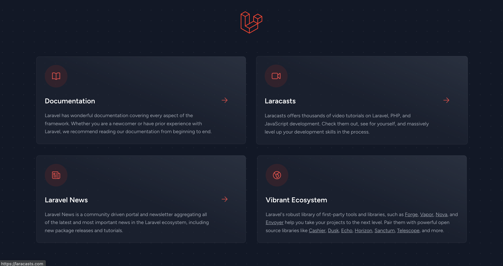

## はじめに

Larvel のお勉強が必要になりそうなので、とりあえず環境を作ります。

基本的に公式ドキュメントを参考にしただけになります。

:::tip[この記事でわかること]
Docker を利用した Laravel 10 の開発環境を構築する方法
:::

## やってみる

### 開発環境

```
$ sw_vers
ProductName:    macOS
ProductVersion: 11.4
BuildVersion:   20F71

$ docker --version
Docker version 24.0.2, build cb74dfc
```

### 作業ログ

#### Laravel Sail を利用して、docker 環境を構築

:::info
公式ドキュメントは[こちら](https://readouble.com/laravel/10.x/ja/sail.html)
:::

ターミナルを開き、下記のコマンドを実行します。

```sh
curl -s "https://laravel.build/example-app" | bash
```

すると、 `example-app`というディレクトリが生成されます。

#### コンテナを起動

`example-app`ディレクトリに移動し、コンテナを起動します。

```sh
$ cd example-app

$ ./vendor/bin/sail up
# バックグラウンドで起動する場合は、「d」オプションを指定します
# $ ./vendor/bin/sail up -d
```

#### 画面確認

http://localhost にアクセスし、以下の画面が表示されると成功です。

:::warning[注意]
この画面は、 2023/12/29 時点のものです。
バージョンによっては、異なる可能性があります。
:::



## まとめ

思い立って環境を作ってみましたが、とても簡単で、すぐ終わりました！

docker で構築するのも公式でサポートしてくれるのはとてもありがたい、、！

## 参考情報

https://laravel.com/docs/10.x/installation#sail-on-macos
